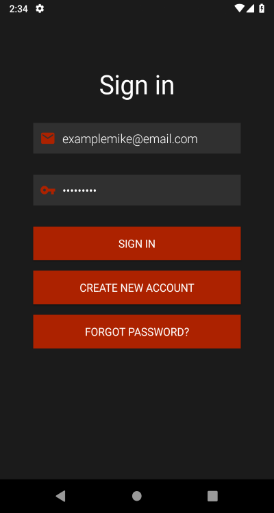

# AnotherBikeApp

Android cycling app built with Firebase. Gives a possiblity to track your route, record useful statistcs and attach photos.
All your data is stored in cloud thanks to Cloud Firestore and Cloud Storage. 
Application is still in development.
For now is not available in Google Play.

# Screenshots
  
 
 

# Third-party software
* [Firebase Authentication](https://firebase.google.com/docs/auth/)
* [Firebase Cloud Firestore](https://firebase.google.com/docs/firestore/)
* [Firebase Cloud Storage](https://firebase.google.com/docs/storage/)
* [Firebase Crashlytics](https://firebase.google.com/docs/crashlytics/)
* [Firebase Android SDK](https://github.com/firebase/firebase-android-sdk)
* [OpenWeatherMap API](https://openweathermap.org/api)
* [Android SDK](https://developer.android.com)
* [Google Maps SDK](https://developers.google.com/maps/documentation/android-sdk/intro)
* [Dagger 2](https://github.com/google/dagger)
* [Retrofit](https://github.com/square/retrofit)
* [RxKotlin](https://github.com/ReactiveX/RxKotlin)
* [RxAndroid](https://github.com/ReactiveX/RxAndroid)
* [Gson](https://github.com/google/gson)
* [Glide](https://github.com/bumptech/glide)
* [Timber](https://github.com/tinsukE/icekick)
* [IceKick](https://github.com/tinsukE/icekick)
* [ThreeTenABP](https://github.com/JakeWharton/ThreeTenABP)
* [Stfalcon Image Viewer](https://github.com/stfalcon-studio/StfalconImageViewer)
### Testing
* [LeakCanary](https://github.com/square/leakcanary)
* [Mockito Kotlin](https://github.com/nhaarman/mockito-kotlin)
* [Mockito](https://github.com/mockito/mockito)
* [JUnit4](https://github.com/junit-team/junit4)
* [Robolectric](https://github.com/robolectric/robolectric)
